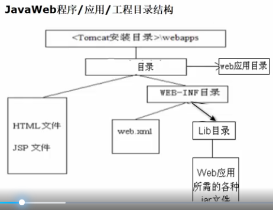

my-webapp/
├── index.html
├── other-static-files/
├── META-INF/
├── WEB-INF/
│   ├── web.xml
│   ├── classes/
│   ├── lib/
│   └── src/

方式1：将web工程的目录拷贝到tomcat的webapps下面去
浏览器通过ip端口/web项目名称/文件名

方式2：
映射到制定目录可以解决磁盘空间不足的问题