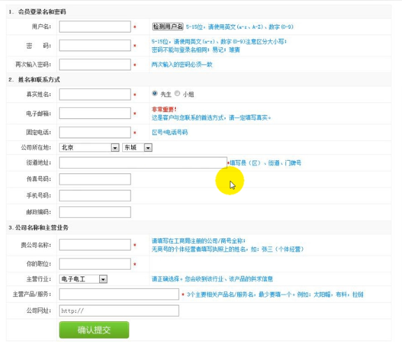

掌握

超链接
    a标签:可定义锚(anchor),锚有两种用法：
    • 通过使用 href 属性，创建指向另外一个文档的链接（或超链接）;
    • 通过使用 name 或 id 属性，创建一个文档内部的书签（也就是说，可以创建指向文档片段的链接）;
<a href =”#A1”>第一章</a>  
<a href =”#A2”>第二章</a>
<a name =”A1”>第一章内容</name>
<a name =”A2”>第二章内容</name>
<a> 标签的两个重要属性:
href:它指链接的目标,也就是超链接关联的另一个资源;
taret:指定使用框架集中的哪个框架来装载另一个资源;属性值有:
    • _slef:表示自身,默认;
    • _blank:新窗口;
    • _top:顶层框架;
    • _parent:父框架;
<base>:标签为页面上的所有链接指定默认地址或默认目标;<base>必须位于 <head></head>标签之间;
<a>标签还可以发送邮件:
<a href="mailto:收件人邮箱?cc=抄送邮箱&subject=主题&body=内容">联系我</a>

列表

图片
    img标签,用于向网页中嵌入一张图片;请注意,从技术上讲 标签并不会在网页中插入图像,而是从网页上链接图像。
     标签有两个必需的属性：src和alt:
        src:该属性指定显示图片文件所在位置;
        alt:该属性指定一段文本,可用于当图片不能显示时显示的提示信息;
        height:指定图片高度,可是像素值或百分比;
        width:指定图片宽度,可是像素值或百分比;
    <map>:创建图像地图:指带有可点击区域的一幅图像
    做图片超链接;
表单标签
    form标签,用于生成输入表单,该标签不可见;在HTML5之前,表单控件,如单行文本框,密码框,单选框等都必须放在<form></form>之间;常见属性如下:
        • action:必填属性,表示当点击”提交”按钮时,表单数据提交到哪个地址;
        • method:指定表单提交时的请求类型,该属性值有get或post,分别用于GET或POST请求,默认是get方式,开发建议使用post方式;
        • enctype:指定表单数据的编码方式,属性有3个值:

    application/x-www-form-urlencoded
    默认,只处理表单控件里的value属性值;
    multipart/form-data
    以二进制流的方式处理表单数据,文件上传时必须使用该属性值;
    text/plain
    不对特殊字符编码,适合于表单的属性值为mailto”URL形式,也就是说该方式适用于表单邮件的发送;

input标签  
    input标签,表单控件标签里功能最丰富的,用于接收用户输入的信息.
    其中的type属性指定输入标签的类型。
        • 单行文本框:type = text,输入的文本信息直接显示在框中;
        • 密码输入框:type = password,输入的文本以圆点形式显示;
        • 单选框:type = radio,如：性别选择;
        • 复选框:type = checkbox,如：多个兴趣选择;
        • 隐藏域:type = hidden, 在页面上不可见,但在提交的时候会一起提交数据,用于隐式向后台传输一个数据;
        • 提交按钮:type = submit,用于提交表单中的数据内容;
        • 重置按钮:type = reset,将表单中填写的内容均设置为初始值;
        • 无动作按钮:type = button,可使用javascript为其自定义事件;
        • 文件上传域:type = file,会生成一个文本框和一个浏览按钮;
        • 图像域:type = image, 它可以替代submit按钮,即图像提交按钮。
    <input>标签其他通用属性:
        • name:指定input标签的名字,没有设置name属性的标签不能提交数据;
        • value:指定input标签的初始值;
        • checked:设置单选框,复选框的初始状态是否选中;
        • disable:设置input标签加载时禁用此标签;
        • maxlength:文本框输入最大字符数,属性值是数字;
        • readonly:指定文本框内值不允许直接修改;
表格标签

框架标签

一个demo
